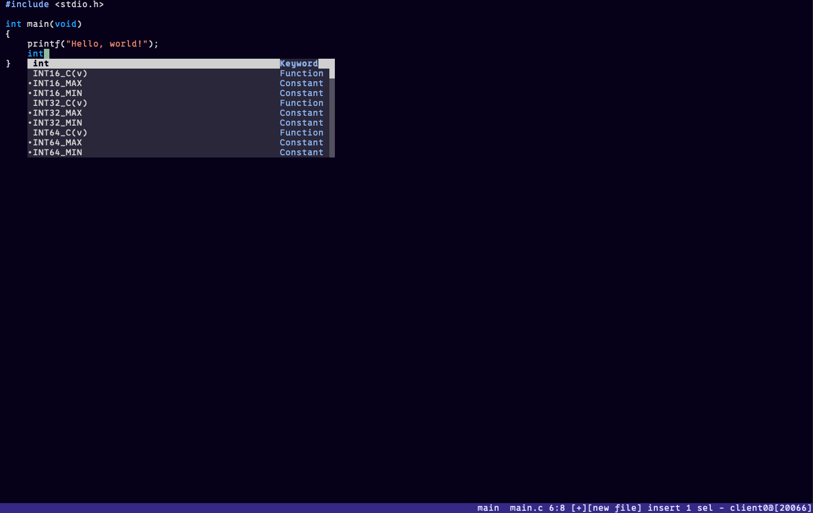

# kakoune-dotfiles
My kakoune dotfiles

# Install
git clone https://git.sr.ht/~enumouse/kakoune-dotfiles ~/.config/kak

# Licenses and Thanks
`kakrc` is under the MIT license

### Plugins
- `auto-pairs`: [Unlicense](https://github.com/alexherbo2/auto-pairs.kak/blob/master/UNLICENSE)

### Others
- `/colors`: [Unknown](https://github.com/Delapouite/kakoune-colors)
